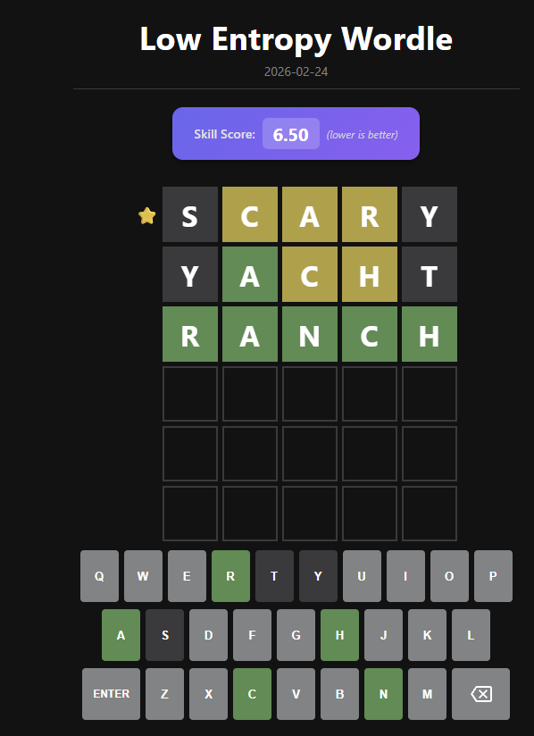

# Low Entropy Wordle

A daily word-guessing game based on [Wordle](https://www.nytimes.com/games/wordle/index.html), with an information-theory twist.

🎮 **Play it live:** [wordle.edeliverables.com](https://wordle.edeliverables.com)



## What makes it different?

Every day you start with a **free clue** — a pre-filled word that shares at least one letter with the answer. Use it wisely to guide your guesses.

At the end of the game you receive a **Skill Score** — a weighted measure of how many correct and present letters you found across your guesses, with earlier rows weighted more heavily. Higher is better.

## How to play

- Guess the 5-letter word in 6 tries
- Row 0 is pre-filled as a free starting clue (marked with ⭐)
- After each guess, tiles reveal how close you are:
  - 🟩 **Green** — correct letter, correct position
  - 🟨 **Yellow** — correct letter, wrong position
  - ⬛ **Gray** — letter not in the word
- A new puzzle is available every day at midnight (New York time)

## Tech stack

- [React 18](https://react.dev/)
- [Vite](https://vitejs.dev/)
- Deployed on a Linux/Nginx server

## Local development

```bash
npm install
npm run dev
```

## Build & deploy

```bash
npm run build
rsync -av --delete dist/ user@yourserver:/var/www/your-site/
```

## Project structure

```
src/
├── components/
│   ├── Board.jsx         # 6-row game grid
│   ├── Keyboard.jsx      # On-screen keyboard
│   ├── ResultModal.jsx   # Win/loss modal + share button
│   ├── Row.jsx           # A row of 5 tiles
│   ├── Tile.jsx          # Single letter tile with flip animation
│   └── WordleGame.jsx    # Main game layout
├── hooks/
│   └── useWordleGame.js  # All game state logic
├── utils/
│   └── gameLogic.js      # Pure functions (checkGuess, scoring, RNG, etc.)
└── data/
    └── words.js          # Word lists (1,015 target words + 3,562 valid guesses)
```
